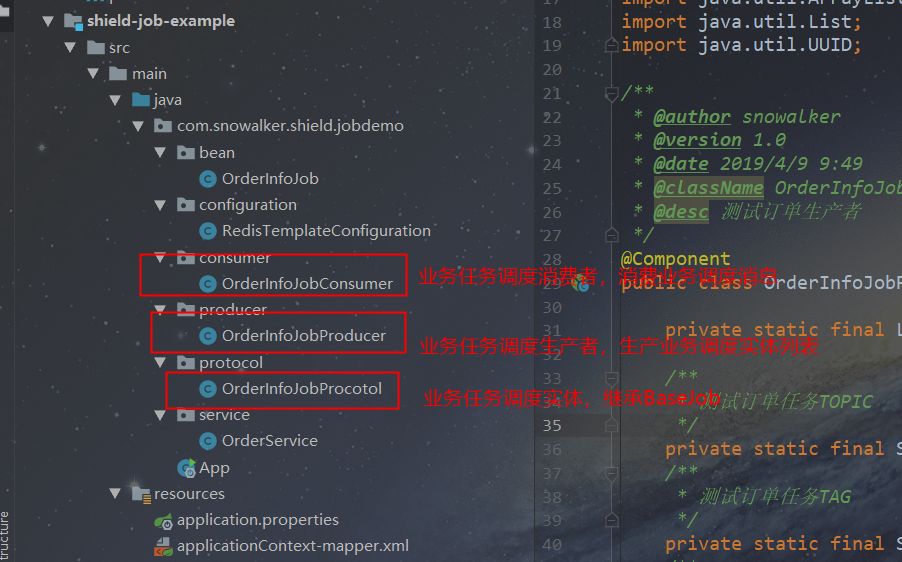

# shield-job

> 基于队列的分布式任务调度及分发中间件，based on RocketMQ

## 结构

| 项目 | 描述 | 功能 |
|  :------ |  :------ |  :------ |
| shield-job-common | shield任务调度核心 | 
| shield-job-scheduler-core | shield任务核心 |
| shield-job-example | shield任务调度示例 |

## 特性

1. 基于RocketMQ实现任务分发，可与定时调度进行无缝集成
2. 解析发送返回体，业务层做后续处理等
3. 多种消息存储设施，目前实现基于Redis队列的消息存储重发
4. 支持单机模式，单机模式下不需要依赖RocketMQ以及Redis

## 详细介绍

<a href="#Part-00">**分布式模式--基于MQ**</a>

<a href="#Part-01">**单机模式--无外部依赖**</a>

## <a name="Part-00">分布式模式--基于MQ</a>

自己写分布式调度组件继续更新，目前已经完成了一个里程碑版本。

千呼万唤始出来，却不是当初想的模样。之前立的flag太大，最终决定暂时放弃开发分布式版本，把目标改为基于消息队列RocketMQ的任务分发框架，具体的调度逻辑由调用方自行开发。

## 客户端接口

> 首先介绍客户端需要关注的接口以及实体

### 客户端实体--任务实体BaseJob

任务实体BaseJob为shield-job的调度核心实体，调用方的业务实体需要继承该作业抽象类，实现其中的**encode()** 以及 **decode(String msg)** 抽象方法。

<!--more-->

其中：

客户端需要在encode()方法中实现业务对象到String形式的消息体转换，如：

    @Override
    public String encode() {
        // 组装消息协议头
        ImmutableMap.Builder headerBuilder = new ImmutableMap.Builder<String, String>()
                .put("version", this.getVersion())
                .put("jobTopic", this.getJobTopic())
                .put("jobTag", this.getJobTag())
                .put("jobBizDesc", "测试订单协议")
                .put("jobProducerGroup", this.getJobProducerGroup())
                .put("jobConsumerGroup", this.getJobConsumerGroup())
                .put("jobTraceId", this.getJobTraceId());
        header = headerBuilder.build();

        body = new ImmutableMap.Builder<String, String>()
                .put("userId", this.getUserId())
                .put("userName", this.getUserName())
                .put("orderId", this.getOrderId())
                .build();

        ImmutableMap<String, Object> map = new ImmutableMap.Builder<String, Object>()
                .put("header", header)
                .put("body", body)
                .build();
        // 返回序列化消息Json串
        String ret_string = null;
        ObjectMapper objectMapper = new ObjectMapper();
        try {
            ret_string = objectMapper.writeValueAsString(map);
        } catch (JsonProcessingException e) {
            LOGGER.error("消息序列化json异常:", e);
        }
        return ret_string;
    }

这里我使用了Guava的ImmutableMap作为消息协议的容器，使用jackson作为Json序列化工具。业务调用方必须将BaseJob的属性逐一填充，否则会在调度过程中抛出参数校验异常。

在decode(String msg)中实现String形式消息体到业务作业对象的转换，如：

    @Override
    public void decode(String msg) {
        Preconditions.checkNotNull(msg);
        ObjectMapper mapper = new ObjectMapper();
        try {
            JsonNode root = mapper.readTree(msg);
            // header
            this.setVersion(root.get("header").get("version").asText());
            this.setJobTopic(root.get("header").get("jobTopic").asText());
            this.setJobTag(root.get("header").get("jobTag").asText());
            this.setJobBizDesc(root.get("header").get("jobBizDesc").asText());
            this.setJobProducerGroup(root.get("header").get("jobProducerGroup").asText());
            this.setJobConsumerGroup(root.get("header").get("jobConsumerGroup").asText());
            this.setJobTraceId(root.get("header").get("jobTraceId").asText());
            // body
            this.setUserName(root.get("body").get("userName").asText());
            this.setOrderId(root.get("body").get("orderId").asText());
            this.setUserId(root.get("body").get("userId").asText());
        } catch (IOException e) {
            LOGGER.error("反序列化消息异常:", e);
        }
    }

这里我将入参消息实体转换为对象本身，通过this对内部的属性进行赋值，从而实现字符串形式的消息体到对象的转换。避免代码过长影响阅读，完整的代码在下文会放出。

### 客户端接口-任务生产

> 这部分的内容为任务生产过程中需要调用的类及接口

#### JobProducerExecutor

> JobProducerExecutor是shield-job的任务生产调度核心，是final类，不允许被继承。

| 类名 | 方法名 | 作用|
|  :------ |  :------ |  :------ |  
| JobProducerExecutor | JobProducerExecutor init(RocketMQProducerProperty rocketMQProducerProperty)  |  初始化任务调度核心类  | 
| JobProducerExecutor  |  Result<JobSendResult> execute(final JobProducerListener jobProducerListener,Object arg)  |  执行Job生产逻辑，投递Job消息到MQ中。业务方需要实现JobProducerListener的任务生产回调方法  | 
| JobProducerExecutor  |  void start() throws MQClientException  |  启动内置的RocketMQ消息生产者,开启任务投递  | 
| JobProducerExecutor  | DefaultMQProducer getProducer()   |  获取RocketMQ生产者引用  | 
| RocketMQConsumerProperty  |  构造方法   |  构造RocketMQ生产者实例配置参数  | 

#### JobProducerListener

> JobProducerListener是作业生产者接口，客户端的作业生产者需要实现该接口，传入需要进行任务调度的作业实体列表（参数泛型继承BaseJob）

| 类名 | 方法名 | 作用|
|  :------ |  :------ |  :------ |  
| JobProducerListener<T extends BaseJob> | List<T> produce(final Object arg)  |  作业调度生产者返回待调度的业务实体协议列表，shield-job会回调该方法并将业务协议列表投递到MQ供作业消费者进行消费  | 

对于非BaseJob的子类，编译阶段即失败。

### 客户端接口--任务消费

> 这部分为任务调度消费过程涉及到的类及接口

#### JobConsumerExecutor

> JobConsumerExecutor是shield-job的任务消费调度核心，是final类，不允许被继承。

| 类名 | 方法名 | 作用|
|  :------ |  :------ |  :------ |  
| JobConsumerExecutor | JobConsumerExecutor execute(RocketMQConsumerProperty rocketMQConsumerProperty,JobConsumerListenerAdapter jobConsumerListenerAdapter)  |  初始化任务消费核心，执行任务消费调度过程  |
| JobConsumerExecutor    |   void start() throws MQClientException  |  启动内置的RocketMQ消息消费者，开启任务消费   | 
| RocketMQProducerProperty    |  构造方法   |   构造RocketMQ消费者实例配置参数    | 

#### JobConsumerListenerAdapter

> JobConsumerListenerAdapter是shield-job的任务消费监听适配器，通过调用不同的构造方法决定是否进行消费失败消息的重投递

| 类名 | 方法名 | 作用|
|  :------ |  :------ |  :------ |  
| JobConsumerListenerAdapter  | JobConsumerListenerAdapter(JobConsumerListener jobConsumerListener)  | 任务消费适配器默认构造，只进行消费不进行消息重发  |
| JobConsumerListenerAdapter  |   JobConsumerListenerAdapter(JobConsumerListener jobConsumerListener,JobScheduleExecutorConfig jobScheduleExecutorConfig)  |  任务消费适配器带重发构造，既进行消费又进行消息重发   |
| JobConsumerListenerAdapter  |  ConsumeConcurrentlyStatus consumeMessage(List<MessageExt> msgs,ConsumeConcurrentlyContext context)  |  任务消费核心接口，客户端消费者调用该方法，shield-job根据构造传参自行决定是直接消费还是需要进行消息重发 |

#### JobConsumerListener

> JobConsumerListener是任务消费监听器接口，消费者需要实现consumeMessage方法，完成消息的消费

| 类名 | 方法名 | 作用|
|  :------ |  :------ |  :------ |  
| JobConsumerListener  | ConsumeConcurrentlyStatus consumeMessage(final List<MessageExt> msgs, final ConsumeConcurrentlyContext context)  | 消息消费，该方法为标准的RocektMQ消费接口  |

## 调用实例

上述列出的类及其方法即shield-job任务调度的核心接口，直接看确实不直观，这里我用一个实例去讲解下如何在Spring Boot 2.1.2 Release中整合shield-job实现发布订阅模式的任务调度。

### 项目结构

> 项目结构如下

### 引入shield-job核心依赖，配置RocketMQ

首先引入shield-job核心的坐标，需要自行打包并安装到本地，有条件的可以运行 **mvn clean deploy -DskipTests** 直接发布到私服中。

坐标如下：

    <dependency>
        <artifactId>shield-job-scheduler-core</artifactId>
        <groupId>com.snowalker.shield.job</groupId>
        <version>1.0.0</version>
    </dependency>

由于shield-job核心通过RocketMQ作为任务队列，因此需要在调用方的配置文件中配置RocketMQ的NameServer地址，例如：

    ########################################################################
    #
    #     RocketMQ配置
    #
    #########################################################################
    rocketmq.nameServer=192.168.1.107:9876

### 调度实例--任务生产者的开发

> 首先进行业务层任务生产者的开发。

定义一个名为OrderInfoJobProducer的类，并标记为Spring的bean

    @Component
    public class OrderInfoJobProducer {

        private static final Logger LOGGER = LoggerFactory.getLogger(OrderInfoJobProducer.class);

定义任务发布的MQ的Topic、业务Tag（无tag可以不写）、生产者组、消费者组等参数

        /**
        * 测试订单任务TOPIC
        */
        private static final String TOPIC = "SNOWALKER_TEST_SHIELD_JOB_TOPIC";
        /**
        * 测试订单任务TAG
        */
        private static final String TAG = "SNOWALKER_TEST_SHIELD_JOB_TAG";
        /**
        * 测试订单生产者组
        */
        private static final String PRODUCER_GROUP = "PID_SNOWALKER_TEST_SHIELD_JOB";
        /**
        * 测试订单消费者组
        */
        private static final String CONSUMER_GROUP = "CID_SNOWALKER_TEST_SHIELD_JOB";

读入配置文件中的RocketMQ的NameServer地址

    @Value("${rocketmq.nameServer}")
    private String nameSrvAddr;

声明shield-job的任务生产者执行器JobProducerExecutor

    private JobProducerExecutor jobProducerExecutor;

通过@PostConstruct方式初始化JobProducerExecutor并开启运行内部的生产者

    @PostConstruct
    public void init() throws MQClientException {
        // 实例化作业生产调度器
        jobProducerExecutor = new JobProducerExecutor()
                .init(new RocketMQProducerProperty(PRODUCER_GROUP,nameSrvAddr));
        jobProducerExecutor.getProducer().start();
    }

核心调度逻辑，这里可以选用任意的调度框架，此处为spring-scheduler方式，通过 @Scheduled 注解声明此处为定时任务调度核心，并引入配置文件中的cron表达式，示例中的cron表达式为 **0/3 * * * * ?**  表示从0S开始，每次调度之间间隔三秒

    @Scheduled(cron = "${order.resend.cron}")
    public void execute() {
        try {
            // 传入JobProducerListener实现类，返回作业实体
            Result<JobSendResult> jobSendResult = jobProducerExecutor.execute(

此处通过匿名内部类的方式实现了JobProducerListener的回调方法 **produce(Object arg)** 将业务层拼装的业务订单调度协议（OrderInfoJobProcotol继承BaseJob）封装在 List<OrderInfoJobProcotol> 中，供JobProducerExecutor进行回调，提交任务至RocketMQ中。

                    (new JobProducerListener() {
                        @Override
                        public List produce(Object arg) {
                            List<OrderInfoJobProcotol> jobs = new ArrayList<>(10);
                            for (int i = 0; i < 1; i++) {
                                OrderInfoJobProcotol orderInfoJobProcotol = new OrderInfoJobProcotol();
                                orderInfoJobProcotol.setOrderId("OD_" + UUID.randomUUID().toString())
                                        .setUserId("SNOWALKER_" + UUID.randomUUID().toString())
                                        .setUserName("SNOWALKER_" + i)
                                        .setJobTraceId("TRACE_" + UUID.randomUUID().toString())
                                        .setJobTopic(TOPIC)
                                        .setJobTag(TAG)
                                        .setJobProducerGroup(PRODUCER_GROUP)
                                        .setJobConsumerGroup(CONSUMER_GROUP)
                                ;
                                jobs.add(orderInfoJobProcotol);
                            }
                            return jobs;
                        }
                    }), null);

这里可以根据返回的 **Result** 对返回的任务提交实体进行更多的操作。JobSendResult中包含了每一次调度中提交成功的任务列表 **sendSuccessJobList** 以及 提交失败的任务列表 **sendFailureJobList**，业务层可以解析这两个列表，进行诸如重发、落库等更多的业务操作。

            if (jobSendResult == null) {
                LOGGER.warn("执行作业分发失败,返回为空,topic={}", TOPIC);
            }
            if (jobSendResult.isSuccess()) {
                LOGGER.info("执行作业分发成功,jobSendResult={}", jobSendResult.toString());
            }
        } catch (Exception e) {
            LOGGER.error("执行作业分发异常", e);
        }
    }
}

到此就完成了业务层的任务生产者的开发。

### 调度实例--任务消费者的开发

> 接着进行业务层任务消费者的开发。

首先定义一个业务任务消费者类OrderInfoJobConsumer，标记为Spring的bean。

    @Component
    public class OrderInfoJobConsumer {

        private static final Logger LOGGER = LoggerFactory.getLogger(OrderInfoJobConsumer.class);

声明需要进行订阅的topic、tag（默认为*）、消费者组

        /**测试订单任务TOPIC*/
        private static final String TOPIC = "SNOWALKER_TEST_SHIELD_JOB_TOPIC";
        /**测试订单任务TAG*/
        private static final String TAG = "SNOWALKER_TEST_SHIELD_JOB_TAG";
        /**测试订单生产者组*/
        private static final String CONSUMER_GROUP = "CID_SNOWALKER_TEST_SHIELD_JOB";

引入配置文件中配置的RocketMQ的nameServer地址

        @Value("${rocketmq.nameServer}")
        private String nameSrvAddr;

如果需要在消费失败后，进行消息重发，那么需要引入RedisTemplate，不引入则表示不需要框架做消息重发，业务层自行处理消费失败的逻辑。

        @Autowired
        RedisTemplate redisTemplate;

通过@PostConstruct方式启动任务消费者实例，并实现任务消费逻辑，此处为默认不需要框架进行消费失败后重发job消息的业务逻辑书写方式

@PostConstruct
    public void execute() throws Exception {

        // 不需要重发
        new JobConsumerExecutor().execute(
                new RocketMQConsumerProperty(
                        TOPIC, CONSUMER_GROUP, nameSrvAddr, TAG),
                            new JobConsumerListenerAdapter(new JobConsumerListener() {
                                @Override
                                public ConsumeConcurrentlyStatus consumeMessage(List<MessageExt> msgs, ConsumeConcurrentlyContext context) {
                                    try {
                                        String msgId = "";
                                        String msgBody = "";
                                        // 默认msgs只有一条消息
                                        for (MessageExt msg : msgs) {
                                            String message = new String(msg.getBody());
                                            OrderInfoJobProcotol protocol = new OrderInfoJobProcotol();
                                            protocol.decode(message);
                                            // 解析打印实体
                                            msgId = msg.getMsgId();
                                            msgBody = message;
                                        }
                                        LOGGER.info("模拟订单Job消息消费逻辑结束,状态--[RECONSUME_LATER]--msgId={}", msgId);

                                        return ConsumeConcurrentlyStatus.RECONSUME_LATER;
                                    } catch (Exception e) {
                                        LOGGER.error("钱包扣款消费异常,e={}", e);
                                        return ConsumeConcurrentlyStatus.RECONSUME_LATER;
                                    }
                                }
                            })).start();
    }

可以看到，我们需要做的事情为：

1. 实例化一个任务消费执行器JobConsumerExecutor
2. 调用execute方法，传入RocketMQConsumerProperty实例
3. execute的第二个参数为JobConsumerListenerAdapter实例，它接受一个参数JobConsumerListener，这里我们需要实现JobConsumerListener接口，并将具体的实现的引用传入JobConsumerListenerAdapter构造方法
4. 实现consumeMessage方法，将消费状态ConsumeConcurrentlyStatus返回。shield-job会代理真实的RocketMQ的MessageListenerConcurrently接口，将消费状态返给RocketMQ，效果同直接使用RocketMQ的DefaultMQPushConsumer进行消费相同。

如果我们使用JobConsumerListenerAdapter的另外一个构造方法，**JobConsumerListenerAdapter(JobConsumerListener jobConsumerListener,JobScheduleExecutorConfig jobScheduleExecutorConfig)** ，该构造方法表示需要对消费失败的消息进行消息重发，那么shield-job会对消费状态ConsumeConcurrentlyStatus进行解析，并对达到重试阈值且重发次数小于3的消息进行消息存储并开启异步线程进行重投递，具体代码如下：

    @PostConstruct
    public void execute1() throws Exception {

        JobScheduleExecutorConfig jobScheduleExecutorConfig =
                new JobScheduleExecutorConfig(1,
                        nameSrvAddr,
                        new MessageStoreRedisTemplate(redisTemplate),
                        Executors.newScheduledThreadPool(10),
                        0,
                        3,
                        TimeUnit.SECONDS);

        // 需要消息重发
        new JobConsumerExecutor().execute(
                new RocketMQConsumerProperty(
                        TOPIC, CONSUMER_GROUP, nameSrvAddr, TAG),
                new JobConsumerListenerAdapter(new JobConsumerListener() {
                    @Override
                    public ConsumeConcurrentlyStatus consumeMessage(List<MessageExt> msgs, ConsumeConcurrentlyContext context) {
                        return getConsumeConcurrentlyStatus(msgs);
                    }
                }, jobScheduleExecutorConfig)).start();
    }

可以看到，我们需要构造并实例化任务重发配置JobScheduleExecutorConfig，并将其传入JobConsumerListenerAdapter的构造方法中。

#### 注意

目前该功能还处于进一步测试阶段，因此建议还是使用 **JobConsumerListenerAdapter(JobConsumerListener jobConsumerListener)** 进行JobConsumerListenerAdapter的实例化。

### 调用效果

> 到这里，我们就完成了业务模块对shield-job的整合及调度任务的开发，运行一下程序看一下执行效果。

首先保证业务系统到RocektMQ的连通，执行启动方法，查看到日志如下：

    2019-04-15 14:16:11.188 [main] INFO  c.s.shield.job.consumer.JobConsumerExecutor [45]
    - JobConsumerExecuter init successfully, topic=SNOWALKER_TEST_SHIELD_JOB_TOPIC, consumerGroup=CID_SNOWALKER_TEST_SHIELD_JOB
    2019-04-15 14:16:13.794 [main] INFO  c.s.shield.job.producer.JobProducerExecutor [56] 
    - JobProducerExecutor init successfully, jobProducerGroup=PID_SNOWALKER_TEST_SHIELD_JOB
    ......
    2019-04-15 14:16:14.406 [main] INFO  com.snowalker.shield.jobdemo.App [59] 
    - Started App in 6.482 seconds (JVM running for 7.747)
    2019-04-15 14:16:14.407 [main] INFO  com.snowalker.shield.jobdemo.App [26] 
    - shield-job-server启动完成......
    2019-04-15 14:16:15.577 [scheduling-1] DEBUG c.s.shield.job.producer.JobProducerExecutor [100] 
    - send job message successful, message sendStatus=SEND_OK, msgId=AC1E534751682437C6DC4B28F5D30000, queueOffset=142, transactionId=null, offsetMsgId=AC1E423300002A9F000000000059D06E, regionId=DefaultRegion, sendSuccessJobList.size()=0
    2019-04-15 14:16:15.578 [scheduling-1] INFO  c.s.shield.job.producer.JobProducerExecutor [121] 
    - send job messages finished, sendSuccessJobList messages size=1, sendFailureJobList messages size=0, topic=SNOWALKER_TEST_SHIELD_JOB_TOPIC, tag=SNOWALKER_TEST_SHIELD_JOB_TAG
    2019-04-15 14:16:15.578 [scheduling-1] INFO  c.s.shield.jobdemo.producer.OrderInfoJobProducer [93] 
    - 执行作业分发成功,jobSendResult=Result{code=200, message='SUCCESS', content=JobSendResult{sendSuccessJobList=[BaseJob{version='1.0', jobTopic='SNOWALKER_TEST_SHIELD_JOB_TOPIC', jobTag='SNOWALKER_TEST_SHIELD_JOB_TAG', jobBizDesc='null', jobProducerGroup='PID_SNOWALKER_TEST_SHIELD_JOB', jobConsumerGroup='CID_SNOWALKER_TEST_SHIELD_JOB', jobTraceId='TRACE_cbdb715e-173b-4adc-b0ed-1a1a1aea689c', jobMsgId='AC1E534751682437C6DC4B28F5D30000', params=null}], sendFailureJobList=[]}}
    2019-04-15 14:16:16.454 [ConsumeMessageThread_8] INFO  c.s.shield.jobdemo.consumer.OrderInfoJobConsumer [100] 
    - 模拟订单Job消息消费逻辑结束,状态--[RECONSUME_LATER]--msgId=AC1E534751682437C6DC4B28F5D30000
    

由于我们的调度生产者和消费者在同一个应用内，因此属于 **"自产自销"** 的模式，模拟的订单作业消息投递到MQ之后，下发至当前应用的消费者，被消费者处理。

返回RECONSUME_LATER是笔者为了测试重发，在实际业务中，当作业消费成功，直接返回 **ConsumeConcurrentlyStatus.CONSUME_SUCCESS** 即可。

## 小结

到此，我们就完成了使用shield-job实现业务上的任务调度逻辑的整合过程。代码地址为: [shield-job](https://github.com/TaXueWWL/shield-job)。

后续的文章中，我将对shield-job的实现方式抽丝剥茧，将我在开发过程中的感悟、思考以及一些编码技巧进行进一步的分享。

> 昨夜西风凋碧树。独上高楼，望尽天涯路。

## <a name="Part-01">单机模式--无外部依赖</a>

考虑到部分业务场景下没有使用RocketMQ，因此我在之前的基础上添加了对单机模式调度的封装。

本文就单机模式下，不依赖RocketMQ如何使用shield-job进行定时任务调度展开讲解。

目前有两种主要的调用方式，客户端实现抽象调度方法 **execute** ，或者直接使用内置的 **executeOneway** 方法进行调用，接下来分别介绍两种方式。

<!--more-->

##  调用方式1:自行实现execute方法

首先定义单机调度处理器，继承抽象类AbstractJobScheduleStandaloneHandler，需要实现execute()方法。

    public class MyStandaloneScheduleHandler extends AbstractJobScheduleStandaloneHandler {

            @Override
            public void execute() {
                // 生产
                List<String> list = super.produce(new JobScheduleProducerListener<String>() {
                    @Override
                    public List<String> produce(Object arg) {
                        final List<String> strings2 = new ArrayList<>(10);
                        for (int i = 0; i < 10; i++) {
                            String str = "snowalker-----" + i;
                            strings2.add(str);
                        }
                        return strings2;
                    }
                }, null);

                // 消费
                super.consume(new JobScheduleConsumerListener<String>() {
                    @Override
                    public Object consume(String s) {
                        LOGGER.info("consuming start!!!! s = " + s);
                        return null;
                    }
                }, list);
            }
        }

在实现类的execute()中，分别调用produce和consume方法，实现生产和消费逻辑。

其中，在 **produce(JobScheduleProducerListener<T> jobScheduleStandaloneListener, Object arg)** 方法中实现生产逻辑，客户端需要传入JobScheduleProducerListener的实例，调用方便的情况下可以直接使用匿名内部类或者lambda表达式，将需要进行调度的列表生产出来，具体的生产过程业务方需要关心。

生产完成后，将列表返回，并传入 **consume(JobScheduleConsumerListener<T> jobScheduleConsumerListener, List<T> list)** 方法的第二个参数中，第一个参数为JobScheduleConsumerListener的实例，客户端需要实现消费逻辑，这里的逻辑是单个元素的消费逻辑，不需要再进行迭代了，这样设计的目的是保证集合和单个实体的消费逻辑的统一性。

写个测试用例测一下，日志输入如下。

    13:46:56.528 [main] INFO COMMON-APPENDER - consuming start!!!! s = snowalker-----0
    13:46:56.532 [main] INFO COMMON-APPENDER - consuming start!!!! s = snowalker-----1
    13:46:56.532 [main] INFO COMMON-APPENDER - consuming start!!!! s = snowalker-----2
    13:46:56.532 [main] INFO COMMON-APPENDER - consuming start!!!! s = snowalker-----3
    13:46:56.532 [main] INFO COMMON-APPENDER - consuming start!!!! s = snowalker-----4
    13:46:56.532 [main] INFO COMMON-APPENDER - consuming start!!!! s = snowalker-----5
    13:46:56.532 [main] INFO COMMON-APPENDER - consuming start!!!! s = snowalker-----6
    13:46:56.532 [main] INFO COMMON-APPENDER - consuming start!!!! s = snowalker-----7
    13:46:56.532 [main] INFO COMMON-APPENDER - consuming start!!!! s = snowalker-----8
    13:46:56.532 [main] INFO COMMON-APPENDER - consuming start!!!! s = snowalker-----9

## 调用方式2:executeOneway方式

如果业务逻辑简单，推荐使用executeOneway方式，自描述性更强，调用方式如下

首先定义业务的调度实现类，execute()使用空实现即可。

    public class MyStandaloneScheduleHandler2 extends AbstractJobScheduleStandaloneHandler {

        @Override
        public void execute() {
        }
    }

调用逻辑如下：

        MyStandaloneScheduleHandler scheduleHandler2 = new MyStandaloneScheduleHandler();
        // ②
        scheduleHandler2.executeOneway(new JobScheduleProducerListener<String>() {
            @Override
            public List<String> produce(Object arg) {
                final List<String> strings2 = new ArrayList<>(10);
                for (int i = 0; i < 10; i++) {
                    String str = "executeOneway---snowalker-----" + i;
                    strings2.add(str);
                }
                return strings2;
            }
        }, new JobScheduleConsumerListener<String>() {
            @Override
            public Object consume(String s) {
                LOGGER.info("executeOneway---consuming start!!!! s = " + s);
                return null;
            }
        });

调用MyStandaloneScheduleHandler实例的executeOneway方法，将生产监听器JobScheduleProducerListener实例，消费监听器JobScheduleConsumerListener实例传入。对②处代码的理解就很直观：通过executeOneway发起业务调度，将JobScheduleProducerListener生产的列表在JobScheduleConsumerListener中进行consume，具体的迭代同样封装在了AbstractJobScheduleStandaloneHandler内部。

## springboot调度实战

上文中讲解了如何调用单机模式的shield-job，这里通过springboot的定时任务写一个实例，增强理解。

demo基于 [自己写分布式调度组件shield-job之使用shield-job](http://wuwenliang.net/2019/04/15/%E8%87%AA%E5%B7%B1%E5%86%99%E5%88%86%E5%B8%83%E5%BC%8F%E8%B0%83%E5%BA%A6%E7%BB%84%E4%BB%B6shield-job%E4%B9%8B%E4%BD%BF%E7%94%A8shield-job/) 中的代码。

代码如下：

    @Component
    public class OrderInfoJobProducerStandalone extends AbstractJobScheduleStandaloneHandler {

        private static final Logger LOGGER = LoggerFactory.getLogger(OrderInfoJobProducerStandalone.class);

        private JobProducerExecutor jobProducerExecutor;

        @PostConstruct
        public void init() {
            LOGGER.info("单机模式调度执行初始化......");
        }

        @Scheduled(cron = "${order.standalone.cron}")
        public void execute() {
            executeOneway(new JobScheduleProducerListener<String>() {
                @Override
                public List<String> produce(Object arg) {
                    LOGGER.info("单机模式作业生产开始...");
                    final List<String> strings2 = new ArrayList<>(10);
                    for (int i = 0; i < 10; i++) {
                        String str = "executeOneway---snowalker-----" + i;
                        strings2.add(str);
                    }
                    LOGGER.info("单机模式作业生产结束...");
                    return strings2;
                }
            }, new JobScheduleConsumerListener<String>() {
                @Override
                public Object consume(String s) {
                    LOGGER.info("executeOneway---consuming start!!!! s = " + s);
                    return null;
                }
            });
        }
    }

配置的调度cron表达式为：0/3 * * * * ?

从0s开始，每隔扫描运行一次。

运行程序日志打印如下：

    2019-04-16 14:09:24.001 [scheduling-1] INFO  c.s.s.j.p.s.OrderInfoJobProducerStandalone [40] 
        - 单机模式作业生产开始...
    2019-04-16 14:09:24.001 [scheduling-1] INFO  c.s.s.j.p.s.OrderInfoJobProducerStandalone [46] 
        - 单机模式作业生产结束...
    2019-04-16 14:09:24.001 [scheduling-1] INFO  c.s.s.j.p.s.OrderInfoJobProducerStandalone [52] 
        - executeOneway---consuming start!!!! s = executeOneway---snowalker-----0
    2019-04-16 14:09:24.001 [scheduling-1] INFO  c.s.s.j.p.s.OrderInfoJobProducerStandalone [52] 
        - executeOneway---consuming start!!!! s = executeOneway---snowalker-----1
    2019-04-16 14:09:24.001 [scheduling-1] INFO  c.s.s.j.p.s.OrderInfoJobProducerStandalone [52] 
        - executeOneway---consuming start!!!! s = executeOneway---snowalker-----2
    2019-04-16 14:09:24.001 [scheduling-1] INFO  c.s.s.j.p.s.OrderInfoJobProducerStandalone [52]
        - executeOneway---consuming start!!!! s = executeOneway---snowalker-----3
    2019-04-16 14:09:24.002 [scheduling-1] INFO  c.s.s.j.p.s.OrderInfoJobProducerStandalone [52] 
        - executeOneway---consuming start!!!! s = executeOneway---snowalker-----4
    2019-04-16 14:09:24.002 [scheduling-1] INFO  c.s.s.j.p.s.OrderInfoJobProducerStandalone [52] 
        - executeOneway---consuming start!!!! s = executeOneway---snowalker-----5
    2019-04-16 14:09:24.002 [scheduling-1] INFO  c.s.s.j.p.s.OrderInfoJobProducerStandalone [52] 
        - executeOneway---consuming start!!!! s = executeOneway---snowalker-----6
    2019-04-16 14:09:24.002 [scheduling-1] INFO  c.s.s.j.p.s.OrderInfoJobProducerStandalone [52] 
        - executeOneway---consuming start!!!! s = executeOneway---snowalker-----7
    2019-04-16 14:09:24.002 [scheduling-1] INFO  c.s.s.j.p.s.OrderInfoJobProducerStandalone [52] 
        - executeOneway---consuming start!!!! s = executeOneway---snowalker-----8
    2019-04-16 14:09:24.002 [scheduling-1] INFO  c.s.s.j.p.s.OrderInfoJobProducerStandalone [52] 
        - executeOneway---consuming start!!!! s = executeOneway---snowalker-----9

## 小结

到此就完成了对纯单机模式下调度的抽象和封装的讲解，这种方式对于没有RocketMQ运维能力的项目来讲比较适用。

### 任务生产执行器

1. 定时投递支持，通过开关参数进行配置

### 任务消费执行器

1. 实现队任务消费的重发，做重发表，重发阈值可定义，重发使用线程池

        1. 定义消息重发存储接口
        2. 实现Redis/MySQL版本的存储及重发
        3. 核心功能为消息存储、重发计数、消费成功后删除、死信状态标记
        4. 认为重发队列三次后为死信，入Redis的死信队列。
    
2. 对日志做降级或者考虑自带日志管理

### 其他
1. 扩展任务分发网关
2. 对任务参数进行管理，通过枚举的方式规范参数
3. 文档和demo整理
4. 消息状态查询后台
5. 转储消息,需要在重发任务调度器中完成标记死信以及定时删除消费成功的消息的功能
6. 判断数据库中存储的当前消息的后台线程重提交次数，如果大于最大重发阈值，则不再重发，放入死信队列，直接返回
